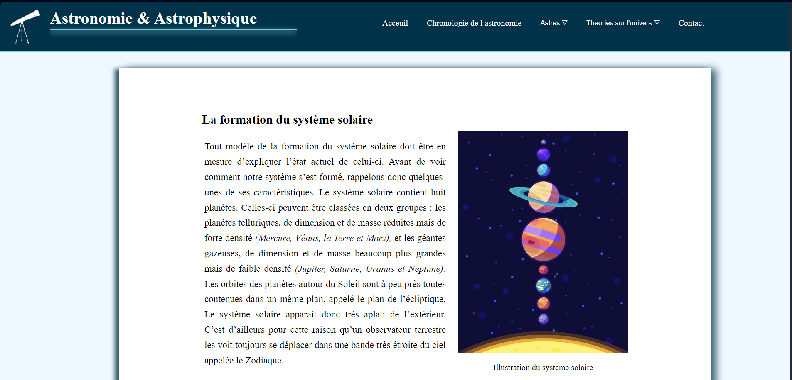
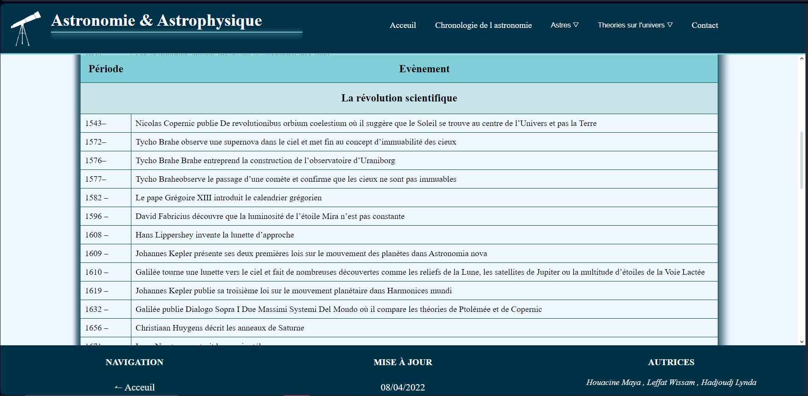
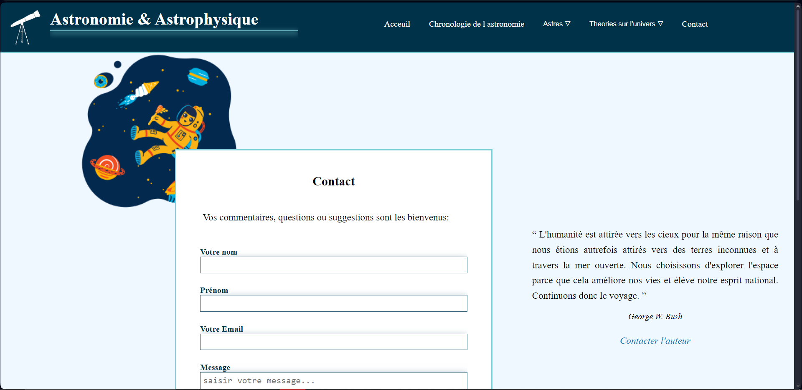

# Astro cube : website about astronomy 🌌

Astro cube is website that distills concepts in astronomy for space lovers. with a clean design and user freindly interface as well as a simple intruitive navigation. This website guarantee the best experience for our fellow curious minds

## Installation 🛠️

Open the file named `indexe`
## Usage/Examples 🪐

Here is an example of a blog post:

  

the website includes a table containing history of discoveries in astronomy:

  

and here is the contact page:

  

## License 📜

[MIT](https://choosealicense.com/licenses/mit/)
